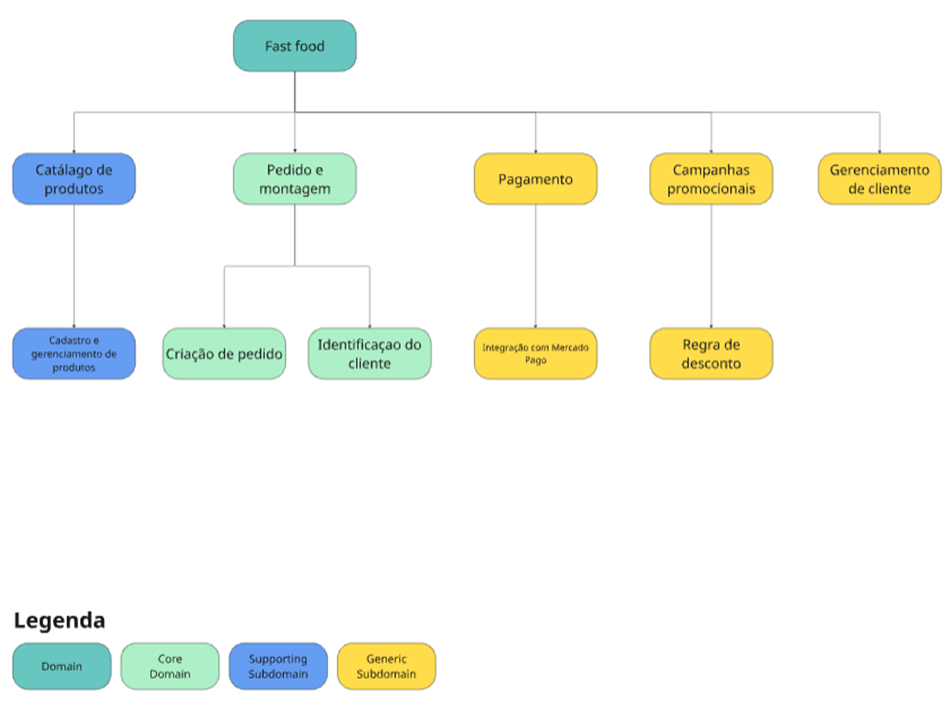
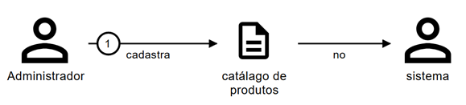
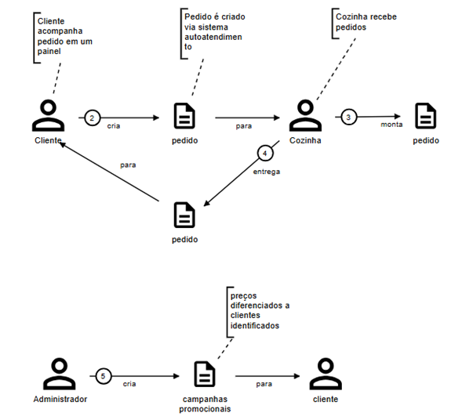
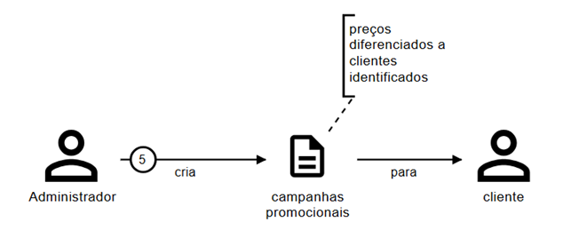
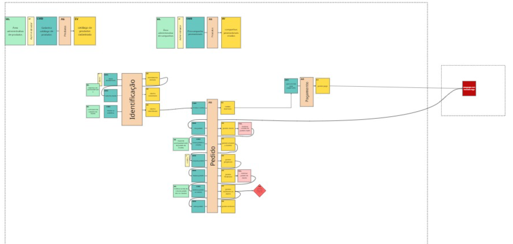
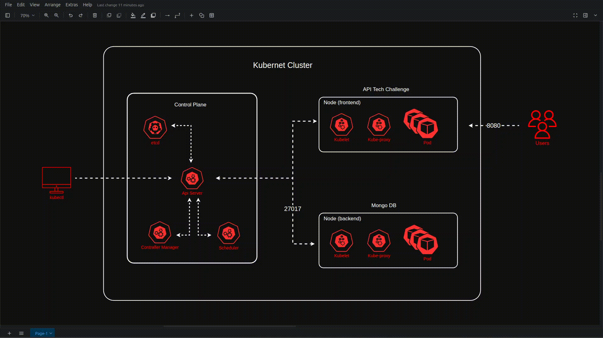

# 🧾 Tech Challenge - Sistema de Autoatendimento para Lanchonete

Este repositório contém o backend do sistema de autoatendimento de fast food desenvolvido para o **Tech Challenge** (Fase 1 e Fase 2), que integra conhecimentos de todas as disciplinas da fase. O projeto endereça o problema de escalabilidade e organização de pedidos de uma lanchonete em expansão, evitando perda de pedidos, atrasos e inconsistências entre atendimento e cozinha.

Na **Fase 1** construímos um **monólito** seguindo **Arquitetura Hexagonal**, entregando as operações essenciais de cadastro de clientes, catálogo e fluxo inicial de pedidos com fila em banco.
Na **Fase 2** evoluímos o código aplicando princípios de **Clean Code** e **Clean Architecture**, adicionando ordenação avançada da lista de pedidos, criação de webhook e desenho/infraestrutura em **Kubernetes** com HPA, ConfigMaps e Secrets.

## Diferenças Principais entre Fase 1 e Fase 2

- **Arquitetura**: de monólito hexagonal (Fase 1) para estrutura reorientada em camadas limpas (interfaces, application/use cases, domain, infrastructure) visando menor acoplamento.
- **Webhook de pagamento**: tratamento explícito de aprovação/recusa para transicionar estado inicial do pedido.
- **Lista de pedidos**: ordenação: (Pronto > Em Preparação > Recebido) e dentro de cada grupo, mais antigos primeiro; pedidos Finalizados excluídos da listagem ativa.
- **Infra**: containerização já existente (Dockerfile + docker-compose) expandida para **manifestos Kubernetes** com Deployment, Service, HPA, ConfigMaps e Secrets.
- **Documentação ampliada**: desenho de arquitetura + guia completo de execução + vídeo demonstrando infra e endpoints.

## 📌 Objetivo

Criar uma aplicação de autoatendimento estilo fast-food que:

- Permita ao cliente realizar pedidos de forma autônoma.
- Integre pagamento via QRCode utilizando **Mercado Pago**.
- Acompanhe o status dos pedidos.
- Forneça ao administrador funcionalidades de gerenciamento de produtos, categorias e clientes.

## 📚 Requisitos de Negócio

### 🧑‍💼 Cliente (Autoatendimento)

- Pode se identificar por CPF
- Pode se cadastrar (nome, e-mail)
- Pode continuar sem se identificar

### Montagem do Pedido

- Selecionar **Lanche** (nome, descrição, preço)
- Selecionar **Acompanhamento** (nome, descrição, preço)
- Selecionar **Bebida** (nome, descrição, preço)

### Resumo e Confirmação do Pedido

- Exibir os itens selecionados e o valor total antes de pagar

### Pagamento

- Integrado via **QRCode do Mercado Pago**

### Acompanhamento do Pedido (pelo cliente)

- Visualizar o status:
  - Recebido
  - Em preparação
  - Pronto
  - Finalizado

### Notificação para Retirada

- O cliente é notificado quando o pedido está pronto

### 👨‍🍳 Cozinha

- Visualizar pedidos recebidos
- Atualizar o status do pedido:
  - Em preparação
  - Pronto
  - Finalizado

### 🛠️ Administrador (Painel de Gestão)

- Cadastrar/editar/excluir produtos com:
  - Nome
  - Descrição
  - Preço
  - Imagem
  - Categoria
    - Lanche
    - Acompanhamento
    - Bebida
    - Sobremesa

### Gerenciar Categorias

- Categorias:
  - Lanche
  - Acompanhamento
  - Bebida
  - Sobremesa

### Acompanhar Pedidos em Tempo Real

- Ver status atual dos pedidos
- Ver tempo de espera por pedido

## 🧩 Domínio



## 📝 Domain Storytelling

### Catálogos de produtos



### Pedido e montagem



### Campanhas promocionais



## 💡 Event Storming

Acesse nosso Miro para análise do processo: [Miro - Tech Challenge](https://miro.com/app/board/uXjVIGfJ2wI=/?share_link_id=33320449721)



## ⚙️ Tecnologias Utilizadas

- **Java 21**
- **Spring Boot**
- **MongoDB**
- **Mercado Pago SDK**
- **Docker**
- **Lombok**
- **Kubernets**
- **Mongock**

---

### Documentação

- **Swagger/OpenAPI** exposto em `/swagger-ui`.

## 📁 Estrutura do Projeto

- `api`: Camada responsavel por expor os endpoints da aplicação.
- `controller`: Camada responsavel por distribuir as chamadas externas recebidas para os usecases.
- `gateway`: Camada responsavel por interagir com a camada de repositories.
- `usecase`: Camada responsavel por conter a regra da aplicação.
- `entity`: Camadas responsavel por conter as regras de negocios da aplicação.
- `adapter`: Camada responsavel por fazer adaptação dos dados entre camadas.
- `data model`: ODMs da aplicação.
- `infrastructure`: configurações da aplicação (ex: Mercado Pago).
- `repositories`: Camada responsavel por fazer chamadas externas necessarias para determinadas regras da aplicação.
- `webhook`: Camada responsavel por receber eventos do mundo externo.
- `util`: enums, exceptions e conversores.
- `k8s`: arquivos de configuração do Kubernetes.

## 🏗️ Arquitetura da Solução

### 🧱 Arquitetura Clean (controller, gateway, usecase, entity)

O projeto adota a arquitetura clean para promover separação de responsabilidades, facilitar testes e permitir a substituição de tecnologias externas com baixo acoplamento e de forma limpa.

- **Camada de entrada (API)**: Controladores REST responsáveis por receber requisições HTTP e convertê-las para os casos de uso da aplicação.
- **Camada de distribuição de chamadas (controller)**: Classes responsaveis por distribuir as chamadas externas para seus devidos usecases.
- **Camada de regras da aplicação (Use Cases)**: Contém a lógica central da aplicação.
- **Camada de comunicação com o externo (Gateway)**: Classes responsaveis por distribuir em quais repositorios buscar os dados necessarios para o usecase.
- **Camada de saída (Repository)**: Classes responsaveis por buscar dados externos.
- **Banco de Dados**: MongoDB, utilizado para persistência dos dados de clientes, produtos, pedidos e pagamentos.
- **Pagamento**: Integração com a API do Mercado Pago utilizando QRCode.
- **Containers**: O MongoDB é executado em container Docker para facilitar o desenvolvimento e testes locais.
```
                      +-------------------------+
                      |   Interface do Cliente  |
                      |     (HTTP REST API)     |
                      +------------+------------+
                                   |
                   +---------------v---------------+
                   |        Camada de Entrada      |
                   |         (API REST - API)      |
                   +---------------+---------------+
                                   |
            +----------------------v----------------------+
            | Camada de distribuição de responsabilidades |
            |         (Controllers REST - API)            |
            +----------------------+----------------------+
                                   |
                   +---------------v---------------+
                   |       Casos de Uso (Core)     |
                   |   Regras de Negócio e Fluxos  |
                   +---------------+---------------+
                                   |
              +--------------------v--------------------+
              |            Camada de Gateway            |
              |   Chamada dos repositorios necessarios  |
              +--------------------+--------------------+
                                   |
              +--------------------v--------------------+
              |          Camada de Repository           |
              |    Chamada externas para buscar dados   |
              +--------------------+--------------------+
                                   |
               +-------------------+-------------------+
               |                                       |
       +-------v--------+                     +--------v--------+
       | Banco de Dados |                     | Serviços Externos|
       |   MongoDB      |                     |  Mercado Pago    |
       +----------------+                     +------------------+
   ```

## 🧱 Arquitetura da infraestrutura



## 🚀 Como Executar Localmente

### Pré-requisitos

- Minikube

### Passo a Passo

1. **Clone o repositório**

   ```bash
   git clone git@github.com:LucasMachadoID2/tech-challenge-fiap.git
   cd tech-challenge-fiap

   ```

2. **Inicie o Minikube**

   ```bash
   minikube start --driver=docker

   ```

3. **Aplique os manifestos Kubernets**

   ```bash
   kubectl apply -f k8s/

   ```

4. **Confirme se tudo esta rodandos**

   ```bash
   watch kubectl get all

   ```

5. **Para acessar a aplicação:**

   ```bash
   http://localhost:8080/swagger-ui/index.html
   ```

   ou execute o comando

   ```bash
   minikube service tech-chall-service
   ```

6. **Teste de Autoescalabilidade de Pods:**

   ```bash
   bash stress.sh 0.001 &
   ```

   Para o teste

   ```bash
   pkill -f stress.sh
   ```

<br>

## 📫 Endpoints Principais

**Clientes:**
| Método | Endpoint | Descrição | Corpo (Request) |
|--------|-----------------------|----------------------------------------|------------------------|
| GET | `/v1/clients` | Listar todos os clientes | — |
| POST | `/v1/clients` | Criar um cliente | `ClientRequestDto` |
<br>

**Produtos:**
| Método | Endpoint | Descrição | Parâmetros / Corpo |
|--------|-----------------------------------------|-------------------------------------------|-------------------------------|
| GET | `/v1/products` | Listar todos os produtos | — |
| GET | `/v1/products/category?category={category}` | Listar produtos por categoria | `category` (enum) |
| POST | `/v1/products` | Criar um produto | `ProductRequestDto` |

**Categorias (CategoryEnum)**: `LANCHE`, `ACOMPANHAMENTO`, `BEBIDA`, `SOBREMESA`.

<br>

**Pedidos:**
| Método | Endpoint | Descrição | Parâmetros
| ------ | --------------------------------------- | -------------------------- |--------------------------|
| POST | `/v1/orders` | Criar um pedido | `OrderRequestDto` |
| PATCH | `/v1/orders/{id}?status={status}` | Atualizar status do pedido | `status` (query param)|

**Status de Pedido (OrderEntityStatusEnum)**: `CRIADO`, `RECEBIDO`, `EM PREPARAÇÃO`.
<br>

**Pagamentos:**
| Método | Endpoint | Descrição |
| ------ | -------------- | ----------------------------- |
| PATCH | `/v1/payments` | Atualizar status do pagamento |
| POST | `/v1/webhooks` | Webhook (Mercado Pago) para atualizar pedido pagamento do pedido |
<br>

## 🙋‍♀️ Equipe

| Nome                               | RA     | Nome Discord                 |
| ---------------------------------- | ------ | ---------------------------- |
| Danilo Augusto Pereira             | 364411 | Danilo Augusto - RM364411    |
| Gabriela Trindade Ferreira         | 364756 | Gabriela Ferreira - RM364756 |
| Guilherme Garcia Dos Santos Moraes | 364613 | Guilherme Garcia - RM364613  |
| Lucas Matheus Monteiro Machado     | 361059 | Lucas Machado - RM361059     |
| Marjory Bispo Matos                | 361150 | Marjory Matos - RM361150     |

```

```
